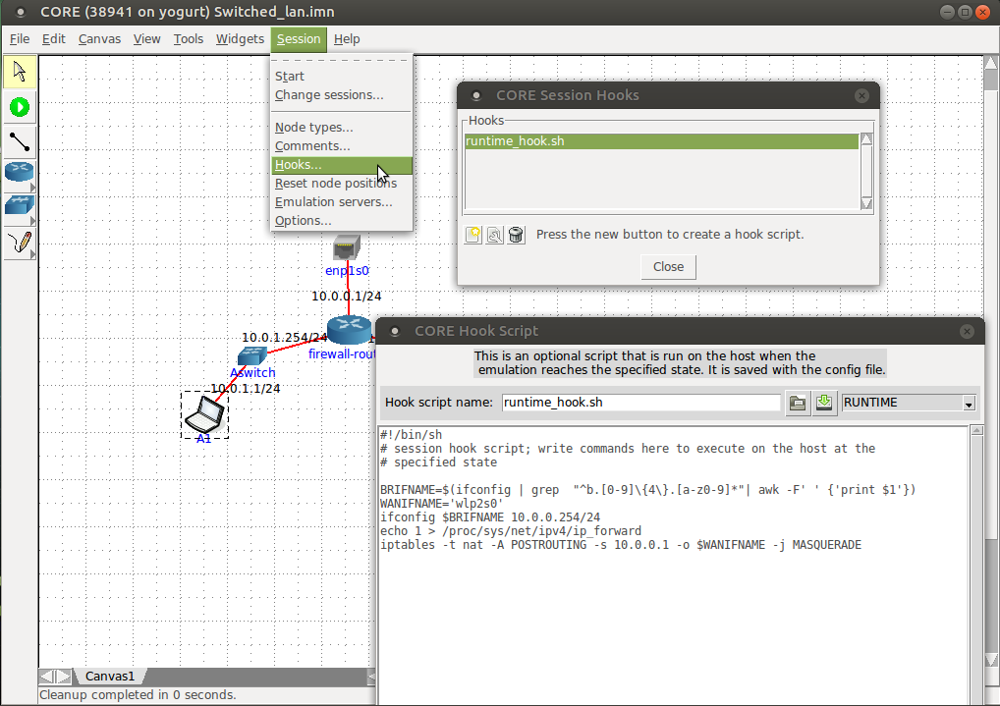
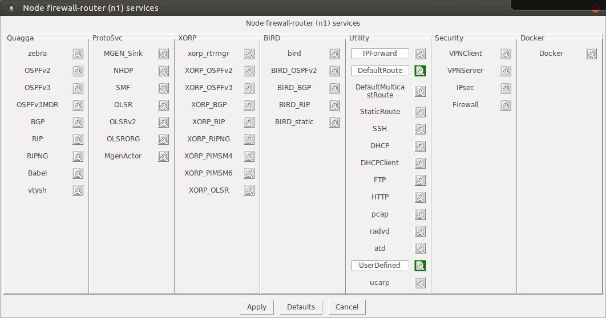
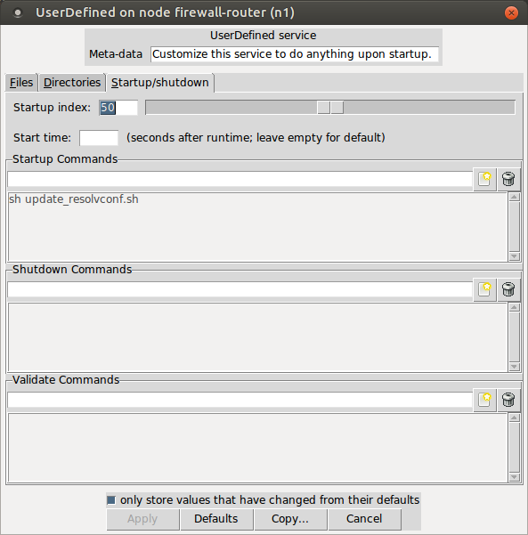
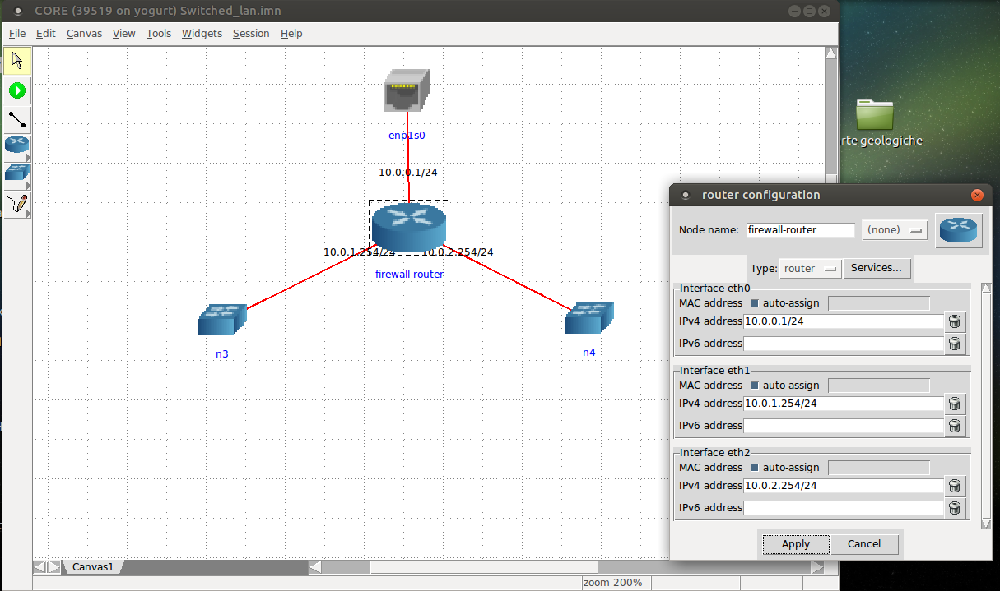

CORE Network Tutorial
---------------------

This is a Tutorial to get the base knowledge of CORE framework.
The configuration of this Tutorial is also available for download in [sources](sources/) folder.

1. Install and Run CORE Network:
    - 1.1 Please download packages or VMware image available from [CORE Network official download page](https://www.nrl.navy.mil/itd/ncs/products/core).
    - 1.2 Install daemon and gui packages. _Hint: On ubuntu 16.04 and ubuntu 18.04 we got trusty packages to work_. 
    - 1.3 Run CORE daemon `/etc/init.d/core-daemon start`.

2. Add a Router and rename it _firewall-router_, then add a physical interface to get a bridge on a real ifname on your workstation: 
    - 2.1 Configure (double click) the physical interface and select an ethernet interface of your workstation;
    - 2.2 Remove ipv6 from _firewall_router_ if you don't need it;
    - 2.3 Using _link tool_ link _firewall-router_ to the physical interface;
    - _Hint: do not use wireless interface for bridging_

    *Problem*: Every time you stop and start your CORE session the Bridge ifname will change on your workstation. Use a command to keep it handy.
    ````
    BRIFNAME=$(ifconfig | grep  "^b.[0-9]\{4\}.[a-z0-9]*"| awk -F' ' {'print $1'})
    ````    
    To make this persistent in a CORE session, as other preferencies, go to _Session -> Hooks_ and configure as follow in picture:
    

3. Run this first test.
    - 3.1 On CORE Network window, run the emulation session clicking on the green arrow, in the left menu.
    - 3.2 Open a terminal on your workstation, check available interfaces (`ifconfig` or `ip ad sh`). You will see at least two brand new interfaces, veth* and b.*. 
    - 3.3 On your Workstation run `brctl show` to check what interfaces is a bridge (probably b.*). You will also see that veth* is the interfaces linked to this bridge.
    
    
    
    
    
    - 3.4 On your Workstation run `tcpdump -i $BRIFNAME`, you will see traffic from the _firewall_router_ like DHCP/BOOT and maybe some ARP request too.  Double click on _firewall_router_, it will open a terminal, see network the network interfaces and check its HWaddress, it's the same you get in the tcpdump stdout.
    ````
    # on your workstation
    tcpdump -i $BRIFNAME
    tcpdump: verbose output suppressed, use -v or -vv for full protocol decode
    for a quickly overview of the devices is better to use " nmcli "
    listening on b.42777.a7, link-type EN10MB (Ethernet), capture size 262144 bytes
    16:53:35.441144 IP 0.0.0.0.bootpc > 255.255.255.255.bootps: BOOTP/DHCP, Request from 00:00:00:aa:00:00 (oui Ethernet), length 300
    16:53:44.446805 IP 0.0.0.0.bootpc > 255.255.255.255.bootps: BOOTP/DHCP, Request from 00:00:00:aa:00:00 (oui Ethernet), length 300
    ````

4. Configure the LAN 10.0.0.0/24 to link your workstation to _firewall_router_. Remember that $BRIFNAME is only a variable name, be sure that this will have a different value on your setup!
    - 4.1 On your Workstation configure the ip with `ifconfig $BRIFNAME 10.0.0.254/24` or `ip ad ch 10.0.0.254/24 dev $BRIFNAME`
    - 4.2 On your Workstation `ping 10.0.0.1` (_firewall_router_). Good news, a working layer2 was created from your workstation to your CORE Network session.
    - 4.3 Disable unecessary routing services, all those that are not needed in this tutorial.
    
    
5. Enable supernetting, _firewall_router_ must reach internet. All these task must be executed on your workstation.
    - 5.1 Enable ip_forward `echo 1 >  /proc/sys/net/ipv4/ip_forward`.
    - 5.2 NAT all the traffic from the bridge to internet using iptables. What's your ifname linked to internet? That is the output interface:
        - `iptables -t nat -A POSTROUTING -s 10.0.0.1 -o wlp2s0 -j MASQUERADE`;
        - 10.0.0.1 is the ip of _firewall_router_;
        - wlp2s0 is the wireless interface that I'm using on my workstation to reach internet;
    - 5.3 Configure a default gateway to _firewall_router_ with command `route add default gw 10.0.0.254`.
    - 5.4 In _firewall-router_ shell test a foreign `ping to 8.8.8.8` or `tracepath -n 8.8.8.8`, you must see it work. Make it persistent.
    

6. Create a persistent configuration in _firewall_router_ with CORE Network hook services.
    - 6.1 This is an example to make a good resolv.conf into the _firewall_router_.
        
        
    
7. Create Collision Zones, the switched LANs in your CORE Network project.
    - 7.1 Add network switches to simulate the real world. Remember that every switch will create a bridge interface in your Workstation, including all the interfaces linked in. This means that we can always sniff the traffic directly in the emulated network switch. Rename the switch _Aswitch_ and _Bswitch_.
        
    - 7.2 Create two nodes, one in the A LAN and another in the B LAN.
    - 7.3 In A1 and B1 configuration change _services.DefaultRoute_ configuring the correct _firewall_router_ ip.
    - 7.4 Run a ]tracepath` from A1 to B1 and viceversa, this is a test to check if networks are now reachable each other through the _firewall_router_.

8. Add some firewall rule in _firewall_router_ configuration:
    - 8.1 Network A must reach internet and not B.
        - 8.1.1 Enable _services.firewall_ in _firewall_router_.
        - 8.1.2 Reject traffic in FORWARD chain, from A to B.
          ````
          # IMPORTANT: accept returning packets from B to A, otherwise packets from B will not be forwarded
          # this means that if B reach A the forward will works because it was previously established 
          iptables -A FORWARD -m state --state RELATED,ESTABLISHED -j ACCEPT
          
          # REJECT traffic from A to B, ip_forward will works but this rule will reject the packets
          iptables -A FORWARD -s 10.0.1.0/24 -d 10.0.2.0/24 -j REJECT
          ````
        - 8.1.3 Add a masquerade rule to NAT all the traffic from A to Internet.
          ````
          iptables -t nat -A POSTROUTING -s 10.0.1.0/24 -o eth0 -j MASQUERADE
          ````
    - 8.2 Network B must reach Internet and also A.
        - 8.2.1 Add masquerade rule to NAT all the traffic from B to Internet
          ````
          iptables -t nat -A POSTROUTING -s 10.0.2.0/24 -o eth0 -j MASQUERADE
          ````

Result
------
Remember: in `~/.core/configs` you will also find more complex examples.


TODO
----
- Make the tasks described in _8._ without iptables but using _Linux Advanced Routing and blackholes_.
- Please contribute, suggest other basic use cases, opening an Issue or Pull Request.


Resources
---------

- http://www.brianlinkletter.com/core-network-emulator-test-drive/
- http://www.brianlinkletter.com/core-network-emulator-services-overview/
- http://www.brianlinkletter.com/core-network-emulator-install-network-services/
